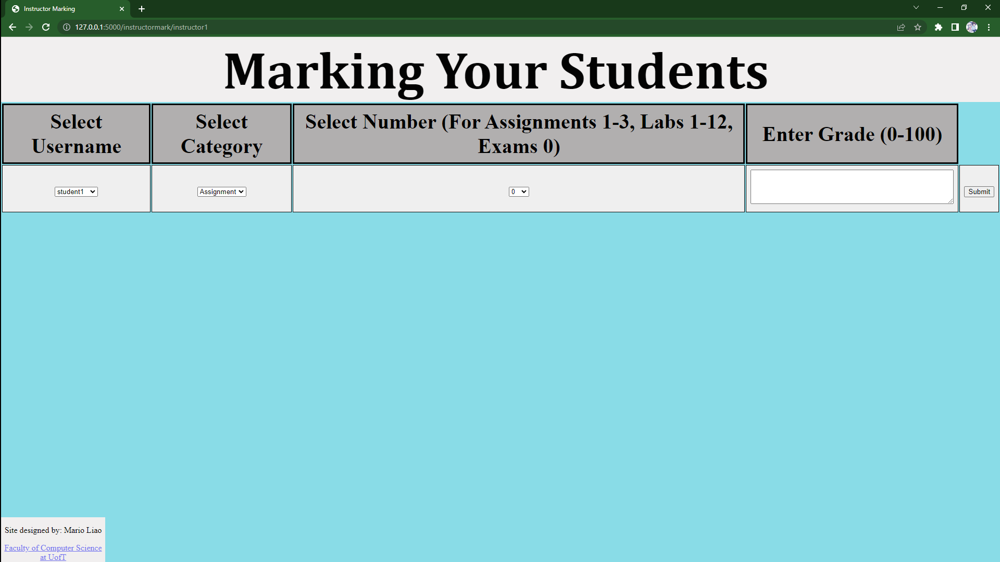

# Course-Website
This is a course website created using HTML, CSS, SQL, and Python Flask.

Below is the register screen:

Below is the login screen:

Below is the Student's Table of Contents:

Below is the Home Page:

Below is the Lectures Page:

Below is the Labs Page:

Below is the Assignments Page:

Below is the Test Page:

Below is the Resources Page:

Below is the Course Team Page:

Below is the FAQ Page:

Below is the Student's View Grade Selection Page:

Below is the Student's Assignment's Grades Page (where they can also send a remark request):

Below is the Student's Labs's Grades Page (where they can also send a remark request):

Below is the Student's Exam's Grades Page (where they can also send a remark request):

Below is the Student's Send Feedback Page (where Student's are able to give Instructors feedback):

Below is the Instructor's Table of Contents:

Below is the Instructor's View Student's Grade Selection Page:

Below is the Instructor's Viewing Student's Assingment Grades Page:

Below is the Instructor's Viewing Student's Lab Grades Page:

Below is the Instructor's Viewing Student's Exam Grades Page:

Below is the Instructor's Viewing Their Own Feedback Sent By Students Page:

Below is the Instructor's Viewing Remark Request Sent By Students Page:

Below is the Instructor's Page Where They Can Enter Student's Mark For Assignment, Labs, and Exams:

